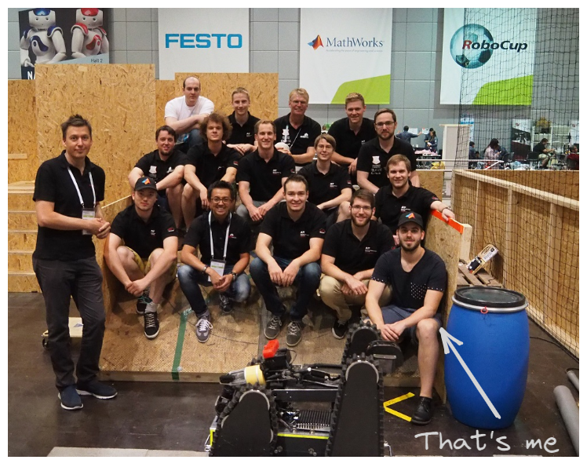

+++
title = "About"
template = "info-page.html"
path = "about"

date = 2024-11-10
updated = 2024-11-12
+++

Hi! My name is Christian Krenslehner. I am a passionate firmware developer and Rustacean in the making. 🦀👷‍♂️

{{ resize_image_relative(path="static/images/me_now.png", height=300, width=300) }}

During my studies in automation technology at the [University of Applied Sciences](https://fh-ooe.at/en/campus-wels) in Wels, Austria, I got in touch with programming and embedded systems. I was fascinated by the interplay of hardware with software, and by the idea of interacting with the real world through code. That's why I joined the [RoboRescueTeam](https://sar.fh-ooe.at/dev/index.php/en/robo-racing/team-dynamics) where I started programming microcontrollers. This was the beginning of my journey into the world of embedded systems.

Source: [RoboRescueTeam at the RoboCup 2016](https://sar.fh-ooe.at/dev/index.php/en/robo-racing/team-dynamics#gallerye2672f1b63-9)

After graduating in 2017 with a master's degree, I moved to Graz, Austria and started to work as a firmware developer in the field of asset tracking. Since then, I was mostly using C and some C++ to program various STM32 microcontrollers running FreeRTOS as a scheduler. C and C++ however, have huge downsides: The type system is not advanced enough to write explicit code, the tooling is outdated, and it's very easy to shoot yourself in the foot by accident. 🦶🔫 Also, there is a lack of standard tools for formatting code and package management. For me, all of this was (and still is) very frustrating at times. So when I discovered Rust, I, finally, found a language that seemed to me like a real competitor to C and C++. A possible alternative for a better future, so to say. 😇 Rust can keep up with the performance of C and C++, but provides outstanding safety guarantees and high-level language features. Safety guarantees, which are much appreciated, especially in embedded programming. Rust empowers you with low-level control over the hardware, but also provides high-level abstractions to make your life easier. Therefore, Rust is a perfect fit for embedded systems development and still a great choice for writing PC applications like CLI tools or web services. A one-stop 
shop for all my programming needs, so to say. Since then, I am really excited about learning more and more about idiomatic Rust code, hence getting a better Rustacean day by day. 😊🚀🦀

Besides technical things, I really enjoy:
- Coffee 🍵
  - No `0xBAADCAFE` for me
- CrossFit 🏋️‍♂️
  - There is no better way to start the day
- Playing computer games at times 💻
- 3D printing

I want to use this blog to share my personal experiences, wins and fails with Rust and various other topics. I also want point out some occasional pitfalls I am stumbling across at my daily work and throughout my learning journey.
Thanks for visiting and I hope you find something interesting here. 😊