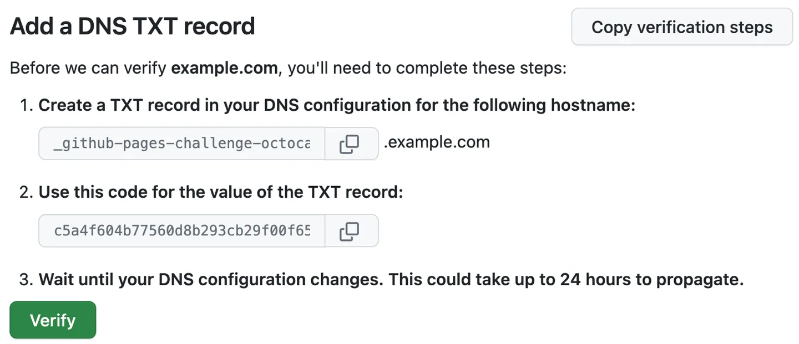
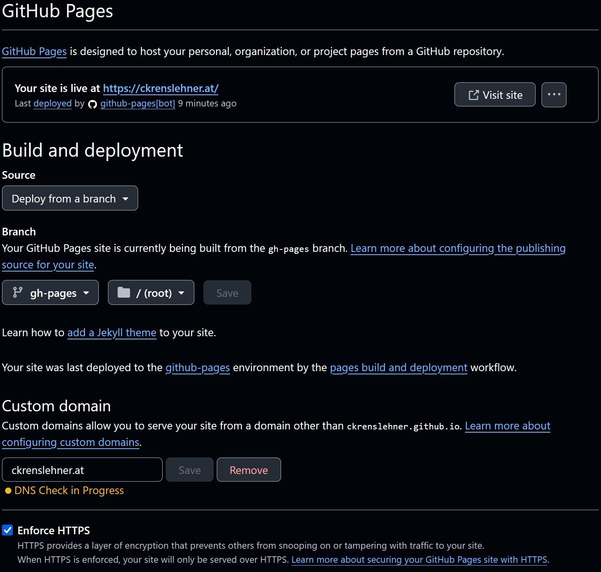

+++
title = """Hi there!"""
description = """My first blog post introducing myself and some of the topics I am planning to write about. I will also quickly cover how I set up this blog using Zola and GitHub Pages."""

date = 2024-11-10
updated = 2024-11-16

[taxonomies]
tags = ["rust", "zola", "github-pages"]
+++

Welcome to my first blog post! 🎉

For an introduction of myself, please visit the [About](@/pages/about/index.md) page.

I want to use this blog as an opportunity to learn about different topics while writing about them. I think writing about something is a great way to learn and understand the topic better. It is also a great way of collecting examples for future reference. As clearly stated on the About page, I am a big fan of Rust. No surprise that I will write a lot about Rust and various topics around it. 

Some of the topics which are in my mind right now are:
- Building LED stripe controller using a [xiao board](https://wiki.seeedstudio.com/XIAO_BLE/) running [embassy-rs](https://github.com/embassy-rs/embassy) as a task runtime
- Trying to build a web application using e.g. [leptos-rs](https://github.com/leptos-rs)
- Encoding messages into a binary wire format. My goto encoding mechanism is [protocol buffers](https://protobuf.dev/). I also want to take a look at [capnproto](https://capnproto.org/) and compare these two

Besides that, I recently started a course to be a certified artificial intelligence consultant. Tools like GitHub Copilot and ChatGPT provide a huge performance boost and are of great help. I think it is important to understand the basics of AI and to keep up with the fast-growing field of AI. That's why I also want to write about different AI related topics.

## How I set up this blog
During my research on how to quickly set up a blog and publish it to GitHub Pages, I first stumbled upon Jekyll. Jekyll is a static site generator. Using static site generators, the content is typically stored as Markdown files. These are then converted into HTML pages using a template engine and a provided theme, which dictates the layout and style. I quickly stumbled upon Hugo as a more modern alternative to Jekyll, and soon afterwards I found Zola. Zola is appealing to me because it comes as a single binary. Also, it is written in Rust (plus points for that) and it seems pretty popular overall, so I decided to give it a try.

I followed the [getting started section](https://www.getzola.org/documentation/getting-started/overview/#first-steps-with-zola) on the Zola website and set up a new site. The guide is pretty straightforward, and the documentation in general is very good and easy to understand. Finding a theme was a bit overwhelming at first, but I decided to go with the [tabi](https://github.com/welpo/tabi) theme, which also includes a getting started guide and a very detailed documentation. Also, a list of [sample websites](https://github.com/welpo/tabi?tab=readme-ov-file#sites-using-tabi) is provided which includes links to the source code of the websites as well. Taking a look at some of them got me started very quickly.

What I like about Zola:
- It is pretty easy to configure via `config.toml`
  - Support for custom taxonomies
- A search feature is built in and can be enabled via the configuration
- A RSS feed generator is built in and can be enabled via the configuration
- After starting the development server with `zola serve` the site is automatically rebuilt when a file changes
  - Blog posts can be marked as drafts and are not included in the generated site
  - `zola serve --drafts` includes drafts in the generated site
  
What I like about tabi:
- The look of the theme is very clean and modern
- You can easily add a [copy button](https://welpo.github.io/tabi/blog/mastering-tabi-settings/#copy-button-on-code-blocks) to code blocks and [reference the source file](https://welpo.github.io/tabi/blog/shortcodes/#show-source-or-path)
- You can use [e-mail obfuscation](https://welpo.github.io/tabi/blog/mastering-tabi-settings/#encoded-email)
  - Just add `email = <YOUR EMAIL AS BASE-64>` to the `[extra]` section in the `config.toml`
- It comes with light and dark mode out of the box
- There is built-in support for [series of blog posts](https://welpo.github.io/tabi/blog/series/#quick-start)

### Deployment to GitHub Pages
Zola provides a github action to deploy the site to GitHub Pages. I followed [this](https://www.getzola.org/documentation/deployment/github-pages/) deployment guide, which almost worked out of the box. Running the given workflow file failed, but I quickly found [this](https://github.com/shalzz/zola-deploy-action/issues/71) issue. Changing the workflow file to use `shalzz/zola-deploy-action@master` fixed the issue. The fixed file looks like this:

{{ add_src_to_code_block(src=".github\workflows\main.yml") }}

``` yaml
# On every push this script is executed
on: push
name: Build and deploy GH Pages
jobs:
  build:
    runs-on: ubuntu-latest
    if: github.ref == 'refs/heads/main'
    steps:
      - name: checkout
        uses: actions/checkout@v4
      - name: build_and_deploy
        uses: shalzz/zola-deploy-action@master
        env:
          # Target branch
          PAGES_BRANCH: gh-pages
          TOKEN: ${{ secrets.GITHUB_TOKEN }}
```

{{ admonition(type="note", icon="info", title="Edit", text="The workflow file of the deployment guide was fixed via [this pull request](https://github.com/getzola/zola/pull/2692)") }}

Finally, as the deployment guide says, I needed to head over to the repository settings and change the following:
- The action permissions needed to be set to read and write
- The source branch for deployment of the pages needed to be `gh-pages`

Now, when a new commit is pushed to the `main` branch, the github action builds and deploys the updated webpage. Finally it can be accessed via [https://ckrenslehner.github.io/](https://ckrenslehner.github.io/).

## Using a custom domain
### Verification
I also wanted to use a custom domain for my blog. Github provides a lot of documentation on how to set up a custom domain. It is stated [here](https://docs.github.com/en/pages/configuring-a-custom-domain-for-your-github-pages-site/about-custom-domains-and-github-pages) that it's recommended to verify your domain prior adding it to GitHub Pages. So I followed these [instructions](https://docs.github.com/en/pages/configuring-a-custom-domain-for-your-github-pages-site/verifying-your-custom-domain-for-github-pages) and added a `TXT` DNS entry in the control panel of my DNS provider. 

{{ admonition(type="note", icon="note", title="Note", text="Just use the copy buttons to get the correct values for the record hostname and record value.") }}


Source: [Github](https://docs.github.com/assets/cb-168491/mw-1440/images/help/pages/verify-dns.webp)

### Connecting the domain to the repository
After my domain was verified, I followed [this section](https://docs.github.com/en/pages/configuring-a-custom-domain-for-your-github-pages-site/managing-a-custom-domain-for-your-github-pages-site#dns-records-for-your-custom-domain) of the documentation. I added the following entries at the DNS provider of my domain `ckrenslehner.at`:

| Host | Type  | Destination            |
|------|-------|------------------------|
| @    | A     | 185.199.108.153        |
| @    | A     | 185.199.109.153        |
| @    | A     | 185.199.110.153        |
| @    | A     | 185.199.111.153        |
| www  | CNAME | ckrenslehner.github.io |

With this configuration `ckrenslehner.at` and `www.ckrenslehner.at` is routed to my github pages repository. To seal the deal, there needs to be a custom domain configuration in the github pages repository too. Github Pages requires a `CNAME` file to be in the root of the publishing branch (`gh-pages` in my case). As stated [here](https://www.getzola.org/documentation/deployment/github-pages/#custom-domain), if there is a `CNAME` file in the `static` directory, it is copied by the zola github action automatically. So I added the following file:

{{ add_src_to_code_block(src="static/CNAME") }}
```
ckrenslehner.at
```

Finally, I enabled HTTPS in the pages settings of the repository. Here is a screenshot of my pages settings: 

